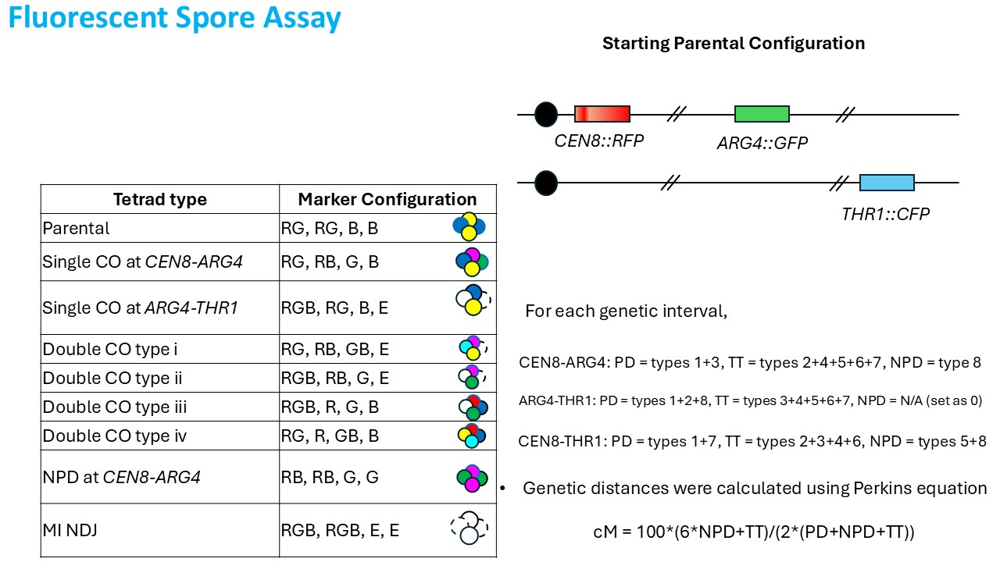

# 📌 Fluorescent Spore Counter - Getting Started

## 🔬 Overview
The **Fluorescent Spore Counter (FSA)** is a tool designed to analyze tetrad dissection outcomes using fluorescent markers in budding yeast. It facilitates efficient scoring of different recombination events based on color markers, allowing researchers to determine crossover frequencies and genetic distances.

## 🌐 Web Application
### **🔗 [Click here to use the Fluorescent Spore Counter](https://arrosancodelab.github.io/Fluorescent-Spore-Counter/)**

## 📂 Repository Link
This repository hosts the code and documentation for the FSA tool: [GitHub Repository](https://github.com/ArrosanCodeLab/Fluorescent-Spore-Counter).

## 🧬 How It Works
FSA utilizes three fluorescent markers:
- **🟥 CEN8::RFP** (Red Fluorescent Protein at CEN8)
- **🟩 ARG4::GFP** (Green Fluorescent Protein at ARG4)
- **🟦 THR1::CFP** (Cyan Fluorescent Protein at THR1)

Based on the segregation patterns of these markers, different recombination events (single and double crossovers, non-parental ditypes, and meiosis I nondisjunction events) can be identified and categorized. Genetic distances are calculated using **Perkins' equation**:

\(cM = \frac{100 \times (6 \times NPD + TT)}{2 \times (PD + NPD + TT)}\)

## 📊 Tetrad Analysis Table
| **Tetrad Type** | **Marker Configuration** |
|---------------|------------------------|
| 🧬 Parental | RG, RG, B, B |
| 🔄 Single CO at CEN8-ARG4 | RG, RB, G, B |
| 🔄 Single CO at ARG4-THR1 | RGB, RG, B, E |
| 🔄 Double CO type i | RG, RB, GB, E |
| 🔄 Double CO type ii | RGB, RB, G, E |
| 🔄 Double CO type iii | RGB, R, G, B |
| 🔄 Double CO type iv | RG, R, GB, B |
| ❌ NPD at CEN8-ARG4 | RB, RB, G, G |
| ⚠️ MI NDJ | RGB, RGB, E, E |

## 🖼️ Visualization
Below is an illustration of the Fluorescent Spore Assay (FSA) setup and marker configurations:



This image represents the starting parental configuration, genetic intervals, and the classification of different tetrad types.

## 🛠️ Installation & Usage
1. Clone this repository:
   ```bash
   git clone https://github.com/ArrosanCodeLab/Fluorescent-Spore-Counter.git
   ```
2. Open the `index.html` file in a browser to use the counter offline.
3. Visit the [web-based counter](https://arrosancodelab.github.io/Fluorescent-Spore-Counter/) for easy tetrad scoring.

## 🤝 Contributions
If you would like to contribute, submit an issue or a pull request. Suggestions and improvements are welcome!

## 📜 License
This project is licensed under the MIT License.

## 📧 Contact
For inquiries, reach out via GitHub issues or contact the repository maintainer.
